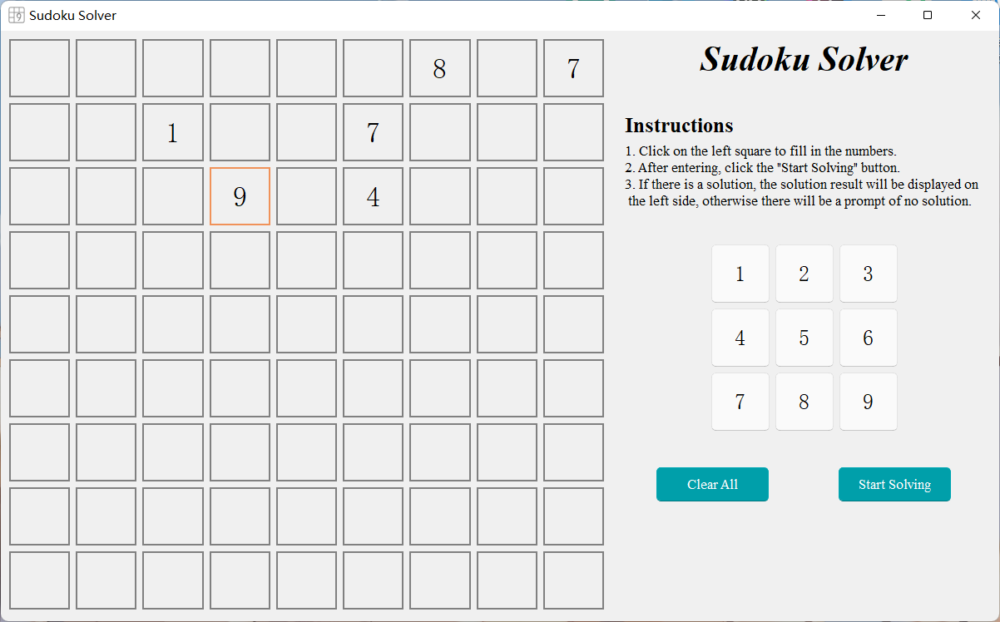
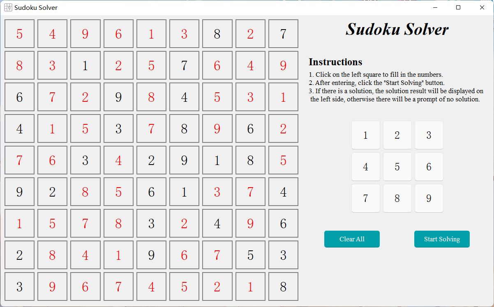

<h2 align="center">Sudoku-Solver</h2>

<h4 align="center">一个基于PyQt5+PyQt_Fluent_Widgets的数独求解器</h4>

### 说明
1. 本项目使用了PyQt_Fluent_Widgets这一组件库的PyQt5版本，若安装环境等出现问题可前往其<a href="https://github.com/zhiyiYo/PyQt-Fluent-Widgets">官网</a>查看安装的详细说明
2. 本项目的1.0.0版本（目前版本）仅支持基础数独的求解，不涉及数独的变式（诸如杀手数独，奇异数独等等），后续会继续完善
3. 如果发现任何bug欢迎前往issue提出

### 界面展示

