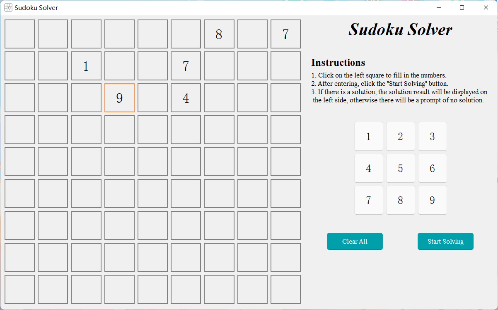

<h2 align="center">Sudoku-Solver</h2>

<h4 align="center">A Sudoku solver based on PyQt5+PyQt_Fluent_Widgets</h4>

### Explanation:
1. This project uses the PyQt5 version of the PyQt_Fluent_Widgets component library. If you encounter any issues with the installation environment, you can visit its <a href="https://github.com/zhiyiYo/PyQt-Fluent-Widgets">official website</a> for detailed installation instructions.
2. The current version of this project is 1.0.0, which only supports solving basic Sudoku puzzles and does not include variations of Sudoku (such as Killer Sudoku, Odd-Even Sudoku, etc.). It will be further improved in future versions.
3. If you discover any bugs, please feel free to submit an issue on the project's issue tracker.

### Display

